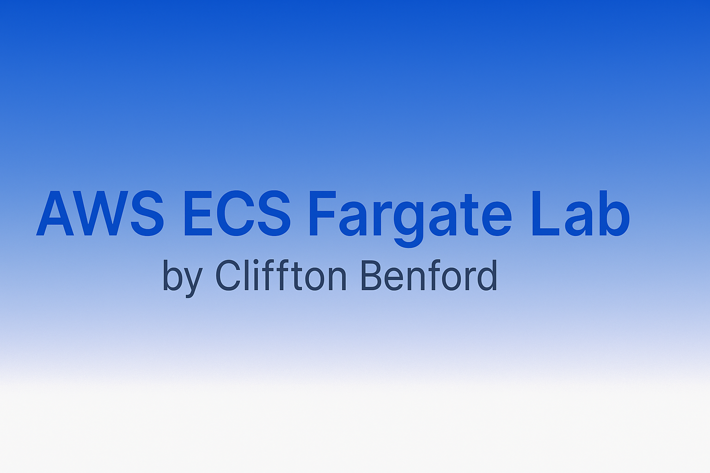

<p align="center">
  
</p>

<h1 align="center" style="color:#1E3A8A; font-weight:800; font-size:2rem;">
  AWS ECS Fargate Lab (Terraform + Node.js)
</h1>

This project demonstrates how to deploy a <strong>containerized Node.js application</strong> to <strong>AWS ECS Fargate</strong> using <strong>Terraform</strong> for Infrastructure as Code (IaC).  
It showcases a full AWS setup with an <strong>Application Load Balancer (ALB)</strong>, <strong>ECS Service</strong>, <strong>Task Definition</strong>, <strong>IAM roles</strong>, and <strong>Amazon ECR</strong> — all automated.


<h2 style="color:#1E3A8A; font-weight:700;">🔁 Architecture Overview</h2>

```mermaid
graph TD
  A[Local Dev / VS Code] -->|Terraform Apply| B[AWS VPC]
  B --> C[Subnets & Security Groups]
  C --> D[Application Load Balancer (ALB)]
  D --> E[ECS Service (Fargate)]
  E --> F[ECS Task Definition]
  F --> G[Container Image from Amazon ECR]
  G --> H[Node.js App Container]
  E --> I[IAM Roles & Policies]

<h2><span style="color:#C0C0C0;">🧩 Tech Stack</span></h2>
Component	Technology
Infrastructure as Code	Terraform
Container Runtime	Docker
Compute Platform	AWS ECS Fargate
Networking	AWS VPC, Subnets, Security Groups
Load Balancing	AWS Application Load Balancer (ALB)
Registry	Amazon ECR
Programming Language	Node.js
IDE / Environment	Visual Studio Code

<h2><span style="color:#1E90FF;">📁 Project Structure</span></h2>
text
Copy code
docker-ecs-fargate-lab/
│
├── app/
│   └── server.js           # Simple Node.js web server
│
├── Dockerfile              # Defines container image build
├── main.tf                 # ECS cluster, service, task definition
├── provider.tf             # AWS provider + region setup
├── variables.tf            # Input variables
├── outputs.tf              # Outputs (ALB DNS, service ARN, etc.)
├── terraform.lock.hcl      # Provider version lock (auto-generated)
├── .gitignore              # Ignore local state / provider binaries
└── README.md               # This file
<h2><span style="color:#C0C0C0;">⚙️ Deployment Steps</span></h2>
1. Build the Docker image locally

bash
Copy code
docker build -t clif-fargate-app .
2. Authenticate Docker to ECR

bash
Copy code
aws ecr get-login-password --region us-east-1 \
  | docker login --username AWS --password-stdin <AWS_ACCOUNT_ID>.dkr.ecr.us-east-1.amazonaws.com
3. Tag and push the image to ECR

bash
Copy code
docker tag clif-fargate-app:latest <AWS_ACCOUNT_ID>.dkr.ecr.us-east-1.amazonaws.com/clif-fargate-app:latest

docker push <AWS_ACCOUNT_ID>.dkr.ecr.us-east-1.amazonaws.com/clif-fargate-app:latest
4. Deploy the infrastructure with Terraform

bash
Copy code
terraform init
terraform plan
terraform apply
After apply, Terraform outputs the ALB DNS name, for example:

text
Copy code
clif-fargate-alb-830625991.us-east-1.elb.amazonaws.com
Hit that URL in your browser and you should see:

text
Copy code
Hello from Clif on ECS Fargate
5. Tear it all down (to stop billing)

bash
Copy code
terraform destroy
This removes:

ECS Cluster, Service, Task

Application Load Balancer + Target Group

IAM roles (including task execution role)

VPC networking (subnets, security groups)

ECR repo (if managed in Terraform)

<h2><span style="color:#C0C0C0;">🧠 Lessons Learned</span></h2>
Understanding how to JSON-encode container definitions inside the ECS task definition using Terraform.

Setting up a correct IAM trust relationship for the ECS task execution role so it can pull from ECR.

Resolving ECR access errors (403 Forbidden when the task couldn't pull the image).

Making sure the ALB target group is listening on the right port and that the security groups allow traffic.

Keeping .terraform/, Terraform state files, and large provider binaries out of Git — using .gitignore correctly.

<h2><span style="color:#1E90FF;">✅ Demo Result</span></h2> <p align="center"> <b>Deployed Successfully!</b><br/> <i>"Hello from Clif on ECS Fargate"</i> </p>
<h2><span style="color:#C0C0C0;">👨‍💻 Author</span></h2>
Cliffton C. Benford
🌐 GitHub: @Tallboycadi
💼 Cloud & DevOps Engineer | AWS | Terraform | Docker | CI/CD
🔗 LinkedIn: www.linkedin.com/in/clifftonbenford-47439036a

<h2><span style="color:#1E90FF;">🏁 Next Steps</span></h2>
Add CI/CD with GitHub Actions (automated terraform plan / terraform apply)

Pipe ECS task logs into CloudWatch Logs for observability

Extend the architecture with data services (Postgres on RDS, or S3 + static front-end)

Add HTTPS in front of the ALB with ACM

<p align="center" style="color:#C0C0C0;"> This project is part of Clif’s Cloud & DevOps Engineer journey — demonstrating real-world AWS infrastructure deployment using Terraform and ECS Fargate. </p>